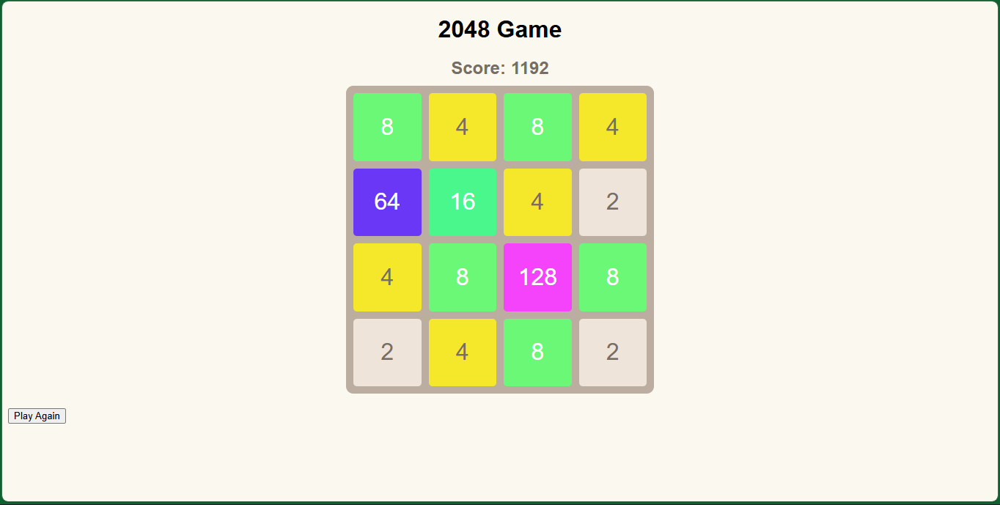

# 2048-game

The 2048 game challenges players to slide numbered tiles on a 4×4 grid.

Combine tiles of the same number to create higher-numbered tiles until reaching 2048.

**Using Basic HTML, JS, and CSS**:
Create a simple HTML file that includes your `script.js` and a stylesheet (e.g., `style.css`).
Then open this HTML file in a browser to play."# A_2048_Game"

# Demo A_2048_Game

